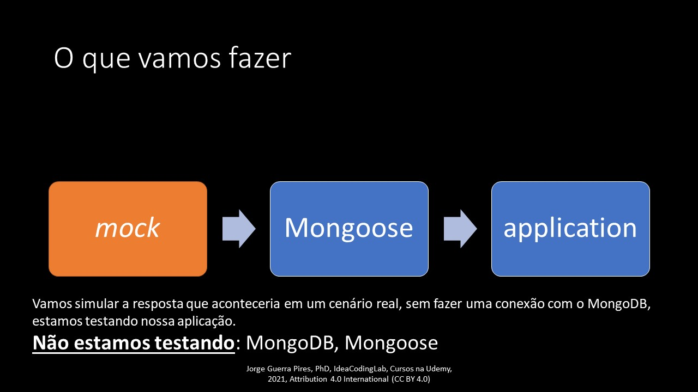

# Ligando os motores

Nessa página, vamos começar a usar o Mongoose. Mongoose, de forma bem simples, é uma biblioteca desenvolvida para facilitar a interface entre MongoDB e Node.js. 

Este livro foi criado para um curso na Udemy, sendo assim, o mesmo deve ser usado em junção com o curso, para maior desempenho. 

## Dependências 

IMP. _**certifique-se de que você tem o MongoDB e Node.js instalados**_.

Vamos usar o  `npm` como instalador e gerenciador de pacotes. Uma alternativa seria o `yarn`. Com exceção de diferenças iniciais, quando o `yarn` foi lançado,  ou quando o usamos React, os dois gerenciadores de pacotes parecem o mesmo. Eu, pessoalmente, salve casos pontuais, não vejo a diferença.  

Crie um `package.json`, antes de instalar o Mongoose, isso vai ajudar depois a gerenciar tudo. 

```
npm init 
```


 Por agora, deixar tudo no _default_. Somente vai confirmando tudo como está. 


Agora, instala o Mongoose! 😀😀

```bash
npm install mongoose 
```

Seu arquivo `package.json` deve ter o seguinte formado, para efeito de clareza:


```javascript
{
  "name": "sandbox-1",
  "version": "1.0.0",
  "description": "",
  "main": "index.js",
  "scripts": {
    "test": "echo \"Error: no test specified\" && exit 1"
  },
  "author": "",
  "license": "ISC",
  "dependencies": {
    "mongoose": "^5.12.13"
  }
}
```



Estamos sendo detalhistas agora, mas quando avançamos mais, será impraticável esse nível de detalhamento nas explicações, consultar os vídeos do curso relacionados à essa documentação na Udemy. 


## Primeiro exemplo, simples: salvando os gatos para compartilhar no WhatsApp

Vamos criar uma aplicação que salva gatos🐱🐱🐱, perfeito para compartilhar no WhatsApp!😂😂😂 Gatinhos peludos e com olhos grandes. 

### Preparação inicial

```javascript
// getting-started.js
const mongoose = require('mongoose');
mongoose.connect('mongodb://localhost/test', { useNewUrlParser: true, useUnifiedTopology: true });

//Seja notificado quando a conexão for feita
const db = mongoose.connection;
db.on('error', console.error.bind(console, 'connection error:'));
db.once('open', function () {
    // we're connected!
    console.log("connected");//pode-se escrever o que quiser aqui, o importante é escrever algo
});

```


getting-started.js é um único documento. Em um cenário real, e vamos fazer isso durante o curso, deve-se separar a conexão do banco de dados do resto da aplicação.



Na linha 10, estamos fazendo um console.log para dizer que estamos conectados, isso ajuda ao desenvolver saber se a conexão foi feita. No NestJS, isso não é necessário, a conexão foi toda automatizada em forma de serviço, uma das grandes vantagens do NestJS sobre o Express. 


### Nosso primeiro esquema

Vamos fazer nosso primeiro esquema, não me refiro a achar uma forma de ganhar vantagens nos outros 😂😂😂. 

MongoDB é um banco de dados não relacional \(NoSQL\). Pode-se fazer qualquer coisa no sentido de formato, esqueça o Excel e comece a pensar orientado a objetos. Você pode salvar no mesmo espaço um gato com 3 patas e um gato com duas, um gato que tem pedigree, e outro que não tem, um gato que tem dono, e outro que não tem. Por agora, não vou entrar nos méritos dessa nova forma de guardar informação, somente aceite que existem vantagens, e desvantagens.... no mundo da programação se diz "_no free lunch_". 


Sugestão de leitura, inglês: [NoSQL at Netflix](https://netflixtechblog.com/nosql-at-netflix-e937b660b4c) , [Big Data Is The New Normal](https://www.mongodb.com/blog/post/big-data-new-normal)



Você consegue investir na MongoDB através da bolsa de valores brasileira, através de BDRs. Código: M1DB34. Atenção. Isso é renda variável! 😅😅😅


```javascript
//nosso esquema para gatos fofinhos 
const kittySchema = new mongoose.Schema({
    name: String
});

```

Estamos dizendo para o Mongoose que os gatos fofinhos precisam de um nome. 


Isso que estamos fazendo é para o Mongoose, não para o MongoDB, para o Mongo, isso não importa. Lembre-se que o Mongo basicamente aceita qualquer coisa, desde que esteja em formato JSON. Se no futuro, além de nome, você quiser acrescentar o dono, somente mude o esquema, não precisa mudar mais nada. Parece-me, baseado em leituras e tutoriais que achei por acaso no YouTube, que bancos de dados SQL apresentam problemas quando precisamos mudar o banco de dados de formato, exigindo o que eles chamam de _Migrations_. Leitura sugerida, inglês: "[Database Migration: What It Is and How to Do It](https://www.cloudbees.com/blog/database-migration)"


Agora precisamos dizer para o Mongoose: "salva aí pô!". Em linguagem do Mongoose:

```javascript
//compilação do nosso esquema
const Kitten = mongoose.model('Kitten', kittySchema);

```

Isso cria um esquema que pode inclusive ser acessado de outras partes da aplicação, como uma variável global. Legal não?!🙃 Calma aí que o Brasil ainda é nosso, vamos usar isso em combate no futuro!

Finalmente, fechamos o ciclo:

```javascript
//Nosso primeiro gato
const silence = new Kitten({ name: 'Silence' });
console.log(silence.name); // imprimi: 'Silence'

```

Isso fecha o ciclo. 


Apesar de termos acesso ao gato, ainda não foi salvo no MongoDB. Isso será essencial para TDD: testes podem ser feitos sem necessidade de se conectar com bando de dados. Salvar, de acordo com minha experiência tanto em primeira mão quanto respondendo perguntas no Stack Overflow, pode causar confusão. 



Certas coisas precisamos estressar sempre: não precisamos desses passos para usar o Mongo, contudo, isso vai facilitar nossas vidas no futuro. Participei de uma minidiscussão informal no _Stack Overflow_ sobre isso: eu acho que é mais fácil usar o Mongoose, contudo, concordo que gera uma curva de aprendizado inicial, e isso pode desencorajar que quer resultados rápidos. Mesmo o TDD, pode ser feito sem o Mongoose! 


### Nosso primeiro método

Para mim, como programador Java, com muito orgulho, adorei essa funcionalidade. Basicamente, pode-se criar métodos para manipular cada campo, or "_path_" usando a linguagem do Mongo.


Java é uma linguagem orientada a objeto. Uma das marcas mais fortes do Java é que as classes, além ter terem atributos, também possuem seus própria métodos de manipulação. Isso é interessante no processo de encapsulamento. No caso do Mongoose, isso cria a possibilidade de se evitar ficar repetindo linhas de códigos, como, digamos, criptografar um campo sempre que for salvo. 


Caso esteja seguindo por aqui, antes da compilação do esquema, coloque:

```javascript
// NOTE: methods must be added to the schema before compiling it with mongoose.model()
kittySchema.methods.speak = function () {
    const greeting = this.name
        ? "Meow name is " + this.name
        : "I don't have a name";
    console.log(greeting);
}

```


Precisa ser antes da compilação do esquema, caso contrário vai dar erro


Depois da compilação do esquema, coloque:

```javascript
const fluffy = new Kitten({ name: 'fluffy' });
fluffy.speak(); // "Meow name is fluffy"

```

Isso vai imprimir a mensagem "Meow name is fluffy". 


Tente mudar no nome do gato e veja o que ocorre! 🙃


## Nosso primeiro test

Para os testes, vamos usar uma biblioteca npm chamada de [Jest](https://jestjs.io/docs/getting-started).


Estamos fazendo o que é conhecido como [Test Driven Design](https://en.wikipedia.org/wiki/Test-driven_development) \(TDD\). A ideia é focar nos testes. Isso, além de automatizar os testes, também, segundo especialistas, ajuda o programador a "receber" feedbacks constantemente no decorrer do desenvolvimento dos códigos, mais discussões em Test-Driven Development: Teste e Design no Mundo Real por Mauricio Aniche. Existe no meu canal um vídeo bem simples, ver [Test-Diven Development \(TDD\) com Jest](https://www.youtube.com/watch?v=BPoqgQdtV2Y).  Não vamos focar em TDD, nem em metodologias de testes semelhantes, como BDD. Essa parte foi adicionada somente para incentivar o uso do TDD, e também para enriquecer o curso, ir além do "feijão com arroz". 


### Testando a saída do esquema

Lembra que imprimimos a saída do esquema? para testarmos se havia realmente salvado o nome do gato no esquema? 

Aquilo que fizemos foi um teste, "meia boca"😂😂😂, mas foi. E se criássemos um teste que simplesmente diria "passou" ou "não passou". Isso pode ser interpretado facilmente, além de poder ser automatizado em processos de _deploys_. 


Sugestão de leitura: "[A diferença entre Integração Contínua, Entrega Contínua e Deploy Contínuo](https://share.atelie.software/a-diferen%C3%A7a-entre-integra%C3%A7%C3%A3o-cont%C3%ADnua-entrega-cont%C3%ADnua-e-deploy-cont%C3%ADnuo-22a3cf4b0930)"


Vamos testar isso em TDD! O que vamos fazer é conhecido como teste de unidade, ou [_unit test_](https://en.wikipedia.org/wiki/Unit_testing) em inglês. Nesse tipo de teste, estamos testando a menor unidade de código possível. O oposto seria teste de integração, ou [_integration test_](https://en.wikipedia.org/wiki/Integration_testing)_._ 

#### Instalando o Jest

```javascript
npm install --save-dev jest
```

#### 


Como estamos testando, isso somente vale para o ambiente de desenvolvimento, por isso instalamos o pacote como --save-dev



Em alguns caso, talvez tenha de instalar globalmente, já tive esse problema! 


#### Criando nosso arquivo para teste

Geralmente, o arquivo de teste leva o mesmo nome do arquivo que será testado +.test.js


.spec.ts também é usando, especialmente com NestJS


```javascript
//getting-started.test.js

const Kitten = require("./getting-started");

describe('Testando nosso modelo de gatos fofinhos', () => {
    it('Estamos testando se o nome é salvo no esquema', () => {
        const name = 'Silence';
        const silence = new Kitten({ name: name });
        expect(silence.name).toBe(name);
    })
})
```

Isso cria nosso primeiro teste com Jest. Isso faz o mesmo que foi feito com console.log, exceto que:

* O teste é automatizado, pode ser facilmente interpretado tanto por outros programadores quanto por sistemas automatizados de deploy;
* O teste não interfere com o código, enchendo de console.log, que depois precisamos lembrar de remover;
* O teste não ativa nada além do que está sendo testando, como no caso de testar os esquemas do Mongoose que vamos fazer no futuro.


O teste foi um sucesso! Agora tente testar se o Mongoose aceita o seguinte para criar o documento:

```javascript
new Kitten({ name })
```


### Testando nosso primeiro método

Como estamos começando, esquentando os motores, o teste que vamos fazer é simples, contudo, o Jest tem muito mais, como spy, mock...ver documentação do [Jest](https://jestjs.io/docs/getting-started). Vamos cobrir neste curso somente o relacionado ao Mongoose, que é o foco do curso, e mesmo assim, não pretendo ser exaustivo. 

Adicione o seguinte ao seu arquivo de teste:

```javascript
describe('Testando os métodos associado ao nosso modelo de gatos fofinhos', () => {
    it('Testando se o gato fala', () => {
        const name = 'Silence';
        const silence = new Kitten({ name: name });
        expect(silence.speak()).toBe(`Meow name is ${name}`);
    })
})
```


Note que criamos um novo _describe._ Eu acho isso bastante relativo, quantos _describes_ usar e quando. Eu separei porque vejo os testes como diferentes, antes testamos se o esquema estava okay, agora estamos testando se os métodos associados ao esquema estão okay. 😉 



O teste vai falhar! Eu sei que isso incomoda, contudo, faz parte do processo do TDD. Antes de continuar, porque está falhando?? qual a forma mais simples de se resolver isso? 


Para passar, somente adicione isso antes de compilar seu esquema Mongoose, no arquivo de definição do esquema:


```javascript
//app.js

// NOTE: methods must be added to the schema before compiling it with mongoose.model()
kittySchema.methods.speak = function () {
    return `Meow name is ${this.name}`
}


```


Nosso teste passou. Sem querer ser estraga momentos, esse foi fácil!! Conseguimos acertar de primeiras. Em outros cenários, será necessário refazer os códigos mais de uma vez. 



## Salvando nosso primeiro documento


No MongoDB, cada conjunto de atributos, ou _paths_ na linguagem do Mongoose, é salvo em um documento. Para os que vem do mundo SQL, não existem tabelas, parece mais com uma classe em Java \([programação orientada a objetos](https://pt.wikipedia.org/wiki/Programa%C3%A7%C3%A3o_orientada_a_objetos#:~:text=Programa%C3%A7%C3%A3o%20orientada%20a%20objetos%20%28POO,procedimentos%2C%20tamb%C3%A9m%20conhecidos%20como%20m%C3%A9todos.) \)


```javascript
  fluffy.save(function (err, fluffy) {
    if (err) return console.error(err);
    fluffy.speak();
  });
```

Esse código salva o documento no Mongoose. 

### Mockando o método _save_ do Mongoose usando mockingoose


Existe toda uma discussões em torna do conceito de _Mock_, _stubs, spy..._ferramentas para testar códigos. Não é o objetivo deste curso adentrar nessas matas perigosas. Vamos discutir o necessário!

Sugestão de leitura: Sebastien DuBois, Alexis Georges. Learn TypeScript 3 by Building Web Applications: Gain a solid understanding of TypeScript, Angular, Vue, React, and NestJS. 22 novembro 2019





Todo o código que fizemos até agora fica o mesmo, vamos apenas testar se tudo salva como planejado.  Encontra-se [aqui](https://github.com/JorgeGuerraPires/curso-mongoose/tree/module_4) uma cópia do que fizemos até agora.


```javascript
//app.test.js
describe('Testando o método save, built-in do Mongoose', () => {

    /**test 1: estamos testando se o método greeting ainda funciona depois de ser retornado  
    */
    it('Estamos testando se o método greeting está funcionando depois de salvar no Mongo', () => {

        const name = 'Silence';
        const doc = { name: name };
        const silence = new Kitten(doc);

        mockingoose(Kitten).toReturn(doc, 'save');

        silence.save(function (err, fluffy) {
            if (err) return console.error(err);
            expect(fluffy.greeting()).toBe(`Miau, meu nome é ${name}`);
        })
    })
})

```


No teste 1, estamos testando se o método retornado pelo Mongoose, depois de salvar no MongoDB, ainda é um documento com todas as funcionalidades. Sim, ele deve ser! Talvez esteja se questionando se isso não seria pesado em um cenário de _Big Data;_ sim, pode ser! Como resolver isso?  Posso pedir ao Mongoose para limpar tudo antes de devolver? sim!

Você precisa somente colocar como _chain o método_ `lean()` Ver documentação [aqui](https://mongoosejs.com/docs/tutorials/lean.html). 

Eu pessoalmente😅, nunca usei, mas pode ser útil para você!😉


Nosso próximo teste é sobre o ID devolvido.


```javascript
    //app.test.js
    /**teste 2: será se o id devolvido respeita os padrões do MongoDB?*/

    it('Estamos testando se o _id bate depois de salvar', () => {        
        const name = 'Silence';
        const doc = { _id: "60cd1ec311ffa407304ec160", name: name };
        const silence = new Kitten({ name: name });

        mockingoose(Kitten).toReturn(doc, 'save');

        silence.save(function (err, fluffy) {
            if (err) return console.error(err);
            expect(objectid.isValid(fluffy._id)).toBeTruthy();
        })
    })
```


Note que os testes aqui foram apenas para efeito de estudar a documentação oficial do Mongoose. Em um cenário real, além destes testes para garantir a integridade das funcionalidades básica, você terá de adicionar mais testes. Ver [aqui](https://www.youtube.com/watch?v=BPoqgQdtV2Y) por curiosidade um vídeo que fiz de TDD em uma função que transforma números romanos em ordinários.



Usamos o pacote [objectid](https://www.npmjs.com/package/objectid).  Este pacote testa o ID devolvido contra os padrões do MongoDB. No Mongo, o usuário pode redefinir esse ID. Geralmente, não se aconselha a redefinir porque o Mongo já tem uma rotina otimizada para garantir restrições como unicidade de cada id dos documentos. Caso defina seu ID, pode usar ferramentas como [Regular expressions](https://developer.mozilla.org/en-US/docs/Web/JavaScript/Guide/Regular_Expressions).



