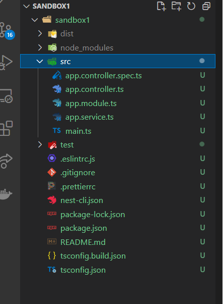

# NestJS, testando aplicações com Jest

## Introdução

[Express](https://pt.wikipedia.org/wiki/Express.js) foi criando para facilitar a manipulação do [NodeJS](https://pt.wikipedia.org/wiki/Node.js). Apesar de todas a facilidades, alguns pontos deixam a desejar. O NestJS foi criado para tentar melhorar esses pontos, como foi [TypeScript](https://en.wikipedia.org/wiki/TypeScript) para melhorar o [JavaScript](https://pt.wikipedia.org/wiki/JavaScript).  Não vamos entrar nos pormenores, vamos direto ao ponto!😁😁


[Documentação oficial](https://docs.nestjs.com/) do NestJS.



Sugestão de leitura: Learn TypeScript 3 by Building Web Applications: Gain a Solid Understanding of TypeScript, Angular, Vue, React, and NestJS Book by Alexis Georges and Sebastien Dubois


Apesar de que não vamos entrar nos pormenores, gostaria deste tutorial ser o mais completo possível, para facilitar o aprendizado!😎😎

## Criando um aplicativo NestJS do zero

Adoraria fazer essa parte grande, para parecer que estou ensinando algo, contudo, somente uma linha de código e você tem uma aplicativo funcional!😂😂 Não dá para ganhar dinheiro dos trouxas assim! 🤣🤣


```text
nest new project-name
```


Vai demorar um pouco para instalar, como o Angular. São parecidos de propósito. O NestJS está no meio termo, entre Angular e Express, acho perfeito para os adeptos do _MEAN stack_ como eu!  🥰🥰🥰


Esta é uma aplicação funcional, tente:

```text
npm start
```

Vai para a porta `3000`


Para quem é programador Angular, você vai se pegar confundindo: onde estou??? frontend ou backend??? parece o mesmo, mas você está no servidor!!! 😯😯😯


Contudo, vamos trabalhar com testes, rode:

```text
npm run test:watch
```


Lembra no curso que precisávamos ficar criando esses comandos no `package.json`, o pessoal do Nest já cria tudo!! 🙏🙏🙏 Soma o tempo que perdia com isso e vai assisti Netflix, programador também é filho de Deus😍😍

Sugestão: [Scorpion](https://pt.wikipedia.org/wiki/Scorpion_%28s%C3%A9rie_de_televis%C3%A3o%29),  



Se quiser, pode deixar a aplicação rodando, somente abra uma nova aba. No [visual studio](https://pt.wikipedia.org/wiki/Microsoft_Visual_Studio) isso é bem simples. 





Todo nosso trabalho está na pasta `src`.  Note que os arquivos de testes estão como `spec`, falamos isso no curso, é a mesma coisa! 😁 Note também que temos uma pasta test, esse para contém testes [e2e](https://www.katalon.com/resources-center/blog/end-to-end-e2e-testing/), não vamos abordar isso. 😅



Alguns pontos que merecem atenção🧐🧐: 

* `ts` significa _typescript_ , que é a linguagem base do Nest;
* `service.ts` é um tipo de arquivo conhecido como serviço, base do Angular. Isso facilita o processo de mocar, além de facilitar a conexão como MongoDB por o fazer em _background;_

\_\_

