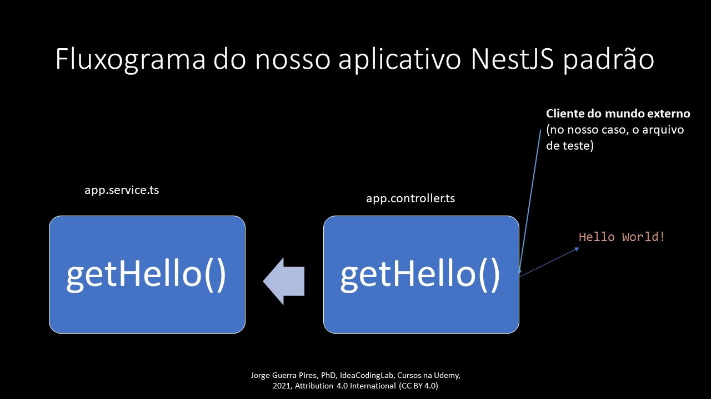

# mockImplementation

## Introdução



Nosso exemplo é bem trivial, nosso objetivo é somente discussão! Vamos testar o resposta do método `getHello()`.

Precisamos preparar o ambiente antes de testar, o código completo está no GitHub, e mais explicação nos vídeo do curso. 

```typescript
  beforeEach(async () => {
    const app: TestingModule = await Test.createTestingModule({
      controllers: [AppController],
      providers:
        [{
          provide: AppService,
          useValue: { getHello: jest.fn().mockImplementation(() => ('Hello World!')) }
        }],
    }).compile();

    appController = app.get<AppController>(AppController);
  });

```

A maior parte do código é padrão, automaticamente gerado quando geramos o aplicativo padrão. 

A parte que nos interesse:

```typescript
      providers:
        [{
          provide: AppService,
          useValue: { getHello: jest.fn().mockImplementation(() => ('Hello World!')) }
        }],

```

* `AppService` é o serviço que estamos mocando.
* `jest.fn().mockImplementation(() => ('Hello World!'))` é o process de mocar: estamos devolvendo o que a função quer: nesse cenário pode ser óbvio, em um cenário real pode ser mais complicado. Lembre-se, o objetivo de mocar é torna nossa vídeo fácil, isolar e simular, tornar nossa código previsível para testes. 


Aprenda mais sobre a função [mockImplementation](https://jestjs.io/docs/mock-function-api#mockfnmockresolvedvaluevalue)


Isso vai passar, mamão com açúcar. 😎 Lembre-se, estamos aprendendo, a função tinha passado de qualquer forma. Observe que agora quem manda na resposta da função é você, não é mais a função original. Essa é uma forma de criar previsibilidade para efeito de teste. 


