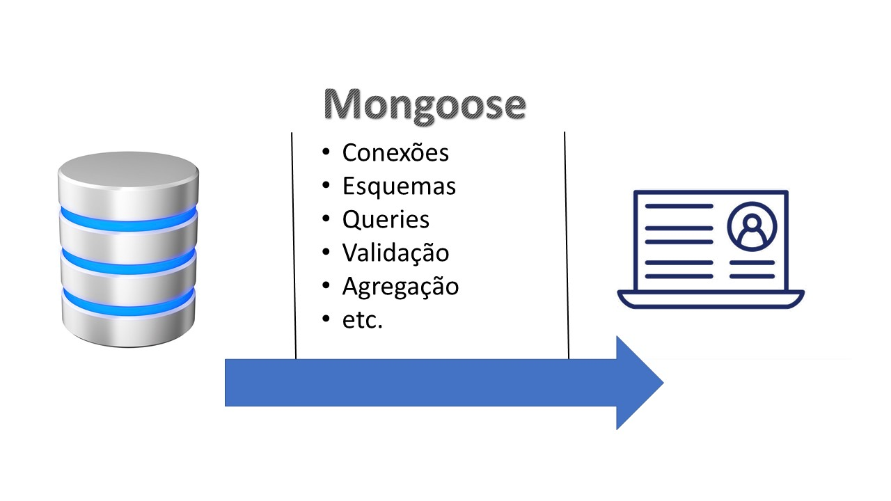

# Mongoose

De acordo com uma sondagem que fiz quando pensava em escrever um livro sobre _MEAN stack_, infelizmente não consegui achar o resultado para compartilhar com vocês, fiz no Facebook, em uma comunidade em inglês do _MEAN stack_, **"programador não gosta de ler"**. 

Infelizmente, acho isso uma pena😌😌 e realmente acho que deveriam ler mais. Um exemplo seria o TDD, que seria um nível de leitura, nesse caso, dos códigos.  Eu também fico ansioso para ver os códigos rodando, mas coloquei na minha cabeça de programar que "a pressa é inimiga da perfeição". 

Recentemente, tive de "enfrentar" meus supervisores de pós-doutoramento, sempre me apresando; desinstalei o WhatsApp para poder trabalhar, somente assim consegui avançar. Note que de forma alguma estou indo contra a ideia de _Startups_, nesse caso realmente a pressa pode ser melhor, mas seria uma pressa intencional nessa caso, como diz Steve Blank "_get out of the building_" 😂😂😂. 


Tem uma discussão bem legal aqui, que tem haver com essa questão de "velocidade vs. qualidade": "[🚀 DevTernity 2017: Ian Cooper - TDD, Where Did It All Go Wrong](https://www.youtube.com/watch?v=EZ05e7EMOLM&t=3023s)"


Refiro-me a uma pressa sem necessidade, sem compromisso com algo, somente para terminar logo. Lembrei-me de uma imagem que infelizmente não salvei, vi no _Facebook_, achar isso vai ser pior do que achar algo no meu computador. 

Basicamente, se comparavam um doutor com um programador: o programar pensava em desisti no primeiro obstáculo, ao passo que o doutorado se leva anos para se terminar.


 "Ensinar programação é um desafio porque programação, como eu vejo é “10% de inspiração e 90% de transpiração.” Usando Thomas Edison como ponto de argumentação. Posso ensinar o básico. Como disse Cal Newport, professor do MIT em programação, em [Deep Work](https://www.amazon.com.br/Deep-Work-Focused-Success-Distracted/dp/1455586692), agora aprender virou o mais importante no mundo, em especial no mundo da [\#programação](https://www.linkedin.com/feed/hashtag/?keywords=programa%C3%A7%C3%A3o&highlightedUpdateUrns=urn%3Ali%3Aactivity%3A6810554764221276160) onde tudo muda muito rápido." fonte: [meu perfil](https://www.linkedin.com/posts/jorgeguerrapires_jorge-guerra-jardim-guanabara-aprenda-activity-6810554764221276160-QTl5) no Linkedin



Para os que gostam do conceito de _startups_, além do conteúdo desse curso, também estudei o conceito de startups no meu pós-doutoramento, com foco ao sistema de saúde. Ver [Alguns insights em Startups em Healthcare](https://www.youtube.com/watch?v=Ek36DmikYP0). 


Conversa à parte, vamos falar do _Mongoose_.


Mongoose foi criado pela mesma empresa do MongoDB. O objetivo do Mongoose é oferecer uma forma de se modelar os dados dentro da aplicação, sem necessariamente perder a flexibilidade do MongoDB. 



"Mongoose cria uma forma direta, focada em esquemas, para se modelar os dados da sua aplicação. Isso inclui funções como tipos embutidos, validação, pedidos, e mais " \[tradução livre\]

Fonte: [https://mongoosejs.com/](https://mongoosejs.com/)


## Modelagem de dados

No contexto do Mongoose, modelagem de dados é quando se defini o que estará em um banco de dados, e como estará, ou seja, os pormenores. Você pode definir nesse processo informações como o tipo do dado, se é obrigatório, limites numéricos...fazemos isso no curso, contudo,  de forma não exaustiva; a documentação oficial oferece muitos outros exemplos que tornariam o curso muito longo e com risco de se perder o foco. Uma das consequências desse processo, e fazemos isso no curso, é que o próprio Mongoose, usando o esquema, filtra o que será salvo. Considere um cenário de `req.body` cheio de informações inúteis, somente o que bate com a modelagem será salvo. 


Fazendo um _spoiler,_ o NestJS agora vem com formas mas elegantes de se trabalhar com o `req.body.` 



Ver aula 17 "Fazendo nosso primeiro teste com Jest, part 2"  \(35:42\). Fiz um corte [aqui](https://www.youtube.com/watch?v=vSpDF5AuGR0).



Vamos usar a notação yy:xx para designar o ponto no vídeo que estamos nos referindo, onde yy é o minuto, e xx os segundos. 


```javascript
//nosso esquema para gatos fofinhos 
const kittySchema = new mongoose.Schema({
    name: String
});
```

No esquema acima, declaramos para o Mongoose que queremos que os gatos tenham nome, somente isso. 

### Testando se salva algo que não existe no esquema

Testamos no curso o cenário de tentarmos salvar a idade, isso falha!

```javascript
    it('Estamos testando se é salvo no esquema algo que não existe', () => {
        const age = 10;
        const silence = new Kitten({ age });
        expect(silence.age).toBeUndefined();
    })
})

```


Jest Matcher usado [`toBeUndefined()`](https://jestjs.io/docs/expect#tobeundefined)\`\`



Fonte [aqui](https://github.com/JorgeGuerraPires/curso-mongoose/tree/module_4). 




#### O que o Mongoose oferece?

* Facilidade na criação de conexões múltiplas. Isso facilita usar o fato de que o MongoDB é _escalável horizontalmente_;
* Facilidade na criação de métodos personalizados para se manipular os atributos dos esquemas, abordado no curso;
* Métodos embutidos para se facilitar atividades padrão como salvar;
* Formas de se conectar diferentes documentos, ver o conceito de _populate_ [aqui](https://www.youtube.com/watch?v=IBZSnb2dxFs);
* Métodos embutidos para validação dos atributos e sistema de mensagens que avisam de erros;
* Outros;


"MongoDB é uma excelente escolha para muitas aplicações web porque oferece o balanço entre velocidade dos bancos de dados puramente baseados em documentos e e o poder de bancos de dados relacionais" \[tradução livre\] Simon&Cliver \(2019\).


É isso aí pessoal, a melhor forma de se aprender é colocando a mão na massa!! Bons estudos! 

 


