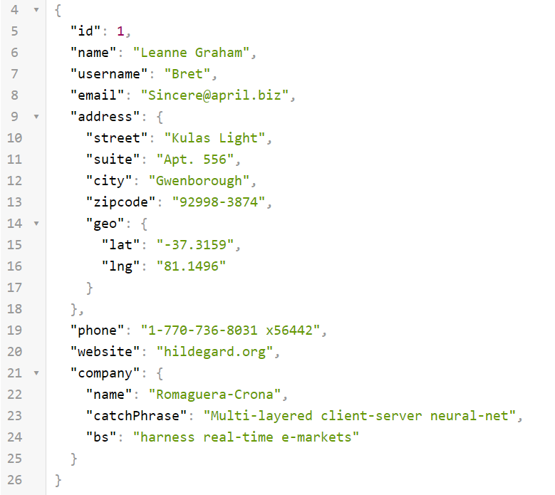

# Funções async

## Primeiros passos 


Caso queira acompanhar, [códigos prontos](https://github.com/JorgeGuerraPires/curso-mongoose/tree/module_jest_2)😎 Sugiro que tente primeiro 😂😂


```javascript
//functions.js

     fetchUser: () =>
        axios
            .get('https://jsonplaceholder.typicode.com/users/1')
            .then(res => res.data)
            .catch(err => 'error')

```



Para testar, podemos usar as seguintes linhas de códigos:

```javascript
// Async Await
test('Versão 1: nome do usuário deverá ser Leanne Graham', async () => {
    expect.assertions(1);
    const data = await functions.fetchUser();
    expect(data.name).toEqual('Leanne Graham');
});

```


`expect.assertions(number)` é uma forma de garantir, em chamadas async, que um número dado de testes são feito.

De acordo com a [documentação oficial](https://jestjs.io/docs/expect#expectassertionsnumber),  "verifica se um dado número de assertivas são chamadas durante uma bateria de testes. Isso pode ser útil se estamos falando de testes assíncronos. Isso garante que o número esperado de assertivas são realmente chamadas " \[tradução livre\] Mão na roda, não?!😂👌


```javascript
// Async Await
test('Versão 2: nome do usuário deverá ser Leanne Graham', async () => {
    expect.assertions(1);
    return functions.fetchUser().then((data => expect(data.name).toEqual('Leanne Graham')));

});

```


Seu teste deve ter esse tipo de saída abaixo, qualquer erro, procure saber o porquê, mesmo que o teste passe, tente entender qualquer erro! Eu mesmo quando comecei a suar o Jest, ignorava alguns erros, ao preparar esse curso, pude ver o porquê. Durante uma aula, tudo passou bem, contudo, não parei enquanto além de passar, nenhum erro aparecesse




Hora da história👂:  no meu doutorado, estava programando uma simulação numérica e Matlab. Estava testando uma ideia. Fiquei semanas trabalhando naquilo. Durante todo o tempo, aparecia uma mensagem no `console.log`, como disse, sempre testei usando `console.log`, agora quero testar com TDD. Finalmente, achei o erro. No Matlab, `;` é para não imprimir, `,` é para imprimir. Havia um `for` com `,` em vez de `;`.  Eu sabia disso, foi um pequeno erro de digitação, que não conseguia achar, e decidi ignorar. 

Moral da história: perdi 2 semanas de cálculos, incluindo gráficos colocados em um artigo, devido a um `console.log` ignorado; cada simulação levava a noite toda, coloquei um áudio que cantava "Haleluia"😂😂😂


