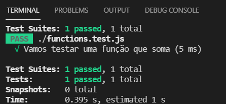

# Primeiros passos

## Introdução

"Minha família inteira é da área médica. Um jantar de fim de semana em casa parece mais um daqueles episódios de seriados médicos da televisão: pessoas discutindo casos e como resolvê-los. Apesar de entender praticamente nada sobre medicina, uma coisa me chama muito a atenção: o fanatismo deles por qualidade. Um médico, ao longo de uma cirurgia, nunca abre mão de qualidade. Se o paciente falar para ele: “Doutor, o senhor poderia não lavar a mão e terminar a cirurgia 15 minutos mais cedo?”, tenho certeza que o médico negaria na hora. Ele saberia que chegaria ao resultado final mais rápido, mas a chance de um problema é tão grande, que simplesmente não valeria a pena." Mauricio Aniche (Author) sobre TDD. 


Olá a todos, enquanto gravava o curso, percebi que precisava revisar, ou mesmo estudar, algumas funcionalidades do Jest. Aproveitei para criar essa seção adicional! 😘 De forma alguma pretendo se exaustivo! Espero que isso ajude pessoas que além do Mongoose, também estejam entrando no mundo do TDD, testes de unidades com Jest. 



Este tutorial é fortemente baseado em "[Jest Crash Course - Unit Testing in JavaScript](https://www.youtube.com/watch?v=7r4xVDI2vho)"



[Documentação oficial](https://jestjs.io/docs/getting-started) do Jest. 



Uma alternativa para o Jest é o [Mocha](https://mochajs.org).  

Sugestão de leitura: Fernando Doglio. REST API Development with Node.js: Manage and Understand the Full Capabilities of Successful REST Development.


Vamos começar criando nosso aquivo `package.json`. 

```bash
npm init -y
```

Esse comando vai criar um `package.json` com as configurações padrões. 


Um problema que demorei a entender o porquê no início foi a necessidade de `package.json`, sem ele, dá erros, e os erros não são informativos o suficiente para entender, nem mesmo para jogar no Google. 


Você vai precisar, caso ainda não tenha instalado, o Jest, instalado como Dev

```bash
npm i -D jest
```

### Testando um função que soma

```javascript
//functions.js
const functions = {
    add: (a, b) => a + b
}

```

Para testar:

```bash
//functions.test.js
const functions = require("./functions");

test("Vamos testar uma função que soma", () => {
    expect(functions.add(2, 2)).toBe(4);
})

```



Testando o que NÃO é:

```javascript
test("Vamos testar uma função que soma: o que não é", () => {
    expect(functions.add(2, 2)).not.toBe(5);
})

```


Estou apresentado, para efeito de estudo, alguns casos. Não vamos usar todos os esses, ou mesmo podemos usar casos diferentes. 😎 Não deixe de consultar a documentação oficial caso esteja adaptando esses exemplos para o seu caso. 


#### Testando para valores "falsy"

```javascript
// toBeNull
test('Deve ser  null', () => {
    expect(functions.isNull()).toBeNull();
});


```

```javascript
// toBeFalsy
test('Deve ser falsy', () => {
    expect(functions.verificador(null)).toBeFalsy();
});

```

#### Testando objetos

```javascript
// toEqual
test('Usuário retornado deve ser Jorge Pires em forma de JSON', () => {
    expect(functions.CriarUsuario()).toEqual({
        firstName: 'Jorge',
        lastName: 'Pires'
    });
});

```


Estamos usando  `toEqual` no lugar de `toBe`. Algumas pista por que???


#### Menor do que

```javascript
// Menor do que
test('Deve ser menor do que', () => {
    const load1 = 800;
    const load2 = 800;
    expect(load1 + load2).toBeLessThanOrEqual(1600);
});

```

#### Expressões regulares (_Regex_)

```javascript
// Regex, pode ser útil para testar id do mongoose caso modifique o id
test('Não existe s em Jorge', () => {
    expect('Jorge').not.toMatch(/I/s);
});

```

#### Testando conteúdo de um array_/JSON_


```javascript
// JSON
test('Testando para admins', () => {
    usernames = { name1: 'Pedro', name2: 'Pedrosa', name3: 'admin' };
    expect(usernames).toMatchObject({ name3: 'admin' });
});

// Arrays
test('Testando para admins', () => {
    usernames = ['john', 'karen', 'admin'];
    expect(usernames).toContain('admin');
});


```


Códigos prontos [aqui](https://github.com/JorgeGuerraPires/curso-mongoose/tree/module_jest\_1).

